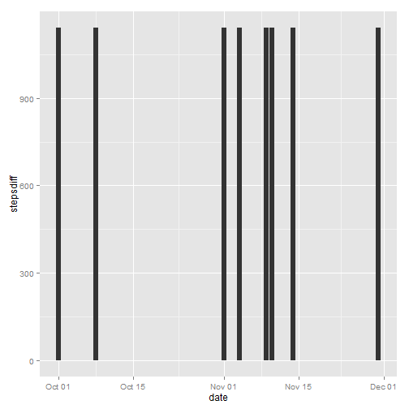

# Reproducible Research: Peer Assessment 1


## Loading and preprocessing the data

```r
require(data.table)
require(ggplot2)
stepdata <- fread("activity.csv")
stepdata$date <- as.Date(stepdata$date)
```


## What is mean total number of steps taken per day?


 

The mean number of steps per day is 9354.2295 and the median number of steps per day is 10395.


## What is the average daily activity pattern?


 


The 5-minute interval, on average across all days that contains the maximum number of steps is 835.


## Imputing missing values


The number of rows containg NAs, incomplete cases, is 2304.


To replace the missing data, I have decided to replace it with median rather than mean data.  Numbers based on the mean could be skewed by some abnormally high activity during any given 5-minute interval.  Median is not perfect, but is more likely to match the "typical" 5-minute interval.  Code below.


```r
stepdata2 <- stepdata
replaceNAs <- as.data.table(stepdata2[,lapply(.SD, function(x) median(x, na.rm = TRUE)), by = "interval", .SDcols = 1])
stepdata2 <- merge(stepdata2, replaceNAs, by = "interval", all.x = TRUE)
sub <- subset(stepdata2, is.na(steps.x))
sub$steps.x <- sub$steps.y 
stepdata2 <- subset(stepdata2, !is.na(steps.x))
stepdata2 <- rbind(stepdata2, sub)
setnames(stepdata2, "steps.x", "steps")
stepdata2$steps.y <- NULL
```


 


The new mean number of steps per day is 9354.2295 and the new median number of steps per day is 10395.  The change to the mean is 149.6393 steps and the change to the median is 0 steps.  The impact of inputing missing is an increase to the total daily number of steps.  See below.

 

## Are there differences in activity patterns between weekdays and weekends?


 
